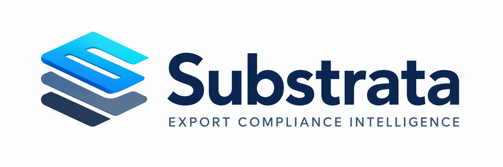

<div align="center">
  <a href="https://github.com/Jungle-Grid/substrata">
    
  </a>

  <h1>Substrata</h1>

  <p><strong>Evidence-backed ECCN review workups for semiconductor and advanced hardware teams.</strong></p>
</div>

Substrata turns semiconductor datasheets and company classification history into cited ECCN review memo drafts for human approval. It is a compliance workspace for preparing source-grounded review workups—not an autonomous compliance authority.

## Why Substrata

Export-control review is slow, document-heavy, and difficult to make consistent. Technical facts, prior company decisions, reviewer notes, and source evidence are often scattered across datasheets, memos, spreadsheets, and internal systems.

Substrata brings that work into one review flow:

1. Upload a datasheet or source package.
2. Extract relevant technical facts with source snippets.
3. Generate candidate review paths, reviewer questions, and uncertainty flags.
4. Compare relevant organization-scoped company history.
5. Produce a cited, human-review-ready classification memo draft.
6. Record reviewer activity and the audit trail.

Human review remains required before an internal conclusion is recorded.

## Product surfaces

- Landing page and authenticated compliance workspace
- Document upload and source-package management
- Extracted technical facts and cited evidence
- Candidate review paths requiring qualified confirmation
- Company history ingestion and comparison workflow
- Reviewer questions, memo drafts, and audit trail
- Human review queue and signoff workflow

## Execution modes

Substrata exposes two user-facing execution modes:

- **Local** — uses the configured local Gemma model with Substrata’s deterministic review engine.
- **Remote** — lets Substrata select the best configured remote provider internally.

Provider names such as Fireworks, Jungle Grid, and AMD Notebook are operational details recorded with the run; they are not top-level user choices. See [Execution modes](docs/EXECUTION_MODES.md) for routing, configuration, and fallback behavior.

## Repository layout

- `apps/web` — Next.js frontend and compliance workspace UI
- `apps/api` — Express API, authentication, tenancy, orchestration, and audit workflows
- `workers/classifier` — Python extraction, deterministic review routing, memo generation, and artifact emission
- `packages/db` — Prisma schema and database client
- `packages/shared` — shared TypeScript validation schemas and types
- `docs` — product, technical, operating, and submission documentation
- `infra` — local infrastructure and runtime notes

## Quick start

1. Copy `.env.example` to `.env` and set `SESSION_SECRET`.
2. Start Postgres: `docker compose -f infra/docker-compose.yml up -d`.
3. Install dependencies: `COREPACK_HOME=/tmp/corepack corepack pnpm install`.
4. Generate the Prisma client and apply migrations: `pnpm db:generate && pnpm db:migrate`.
5. Seed demo data: `pnpm db:seed`.
6. Start the API and web app: `pnpm dev`.

The web app runs on `http://localhost:3000`; the API runs on `http://localhost:4000`.

## Documentation

### Start here

- [Documentation index](docs/README.md)
- [Submission package](docs/submission/README.md)
- [Product brief](docs/submission/PRODUCT_BRIEF.md)
- [Demo script](docs/submission/DEMO_SCRIPT.md)

### Product and compliance

- [Compliance boundaries](docs/submission/COMPLIANCE_BOUNDARIES.md)
- [Company history workflow](docs/submission/COMPANY_HISTORY_WORKFLOW.md)
- [Evidence model](docs/submission/EVIDENCE_MODEL.md)
- [Human review policy](docs/HUMAN_REVIEW_POLICY.md)

### Technical and operations

- [Technical architecture](docs/submission/TECHNICAL_ARCHITECTURE.md)
- [System architecture](docs/ARCHITECTURE.md)
- [Execution modes](docs/EXECUTION_MODES.md)
- [AMD integration](docs/submission/AMD_INTEGRATION.md)
- [AMD/Jungle Grid prototype runbook](docs/hackathon-demo-runbook.md)
- [Security assumptions](docs/SECURITY.md)

## Development checks

```bash
pnpm lint
pnpm typecheck
pnpm test
pnpm build
```

## Contributing

Keep source evidence, uncertainty, human-review boundaries, and organization scoping visible in all product changes. Do not commit credentials or provider API keys.

## License

This repository is licensed under the [MIT License](LICENSE).
