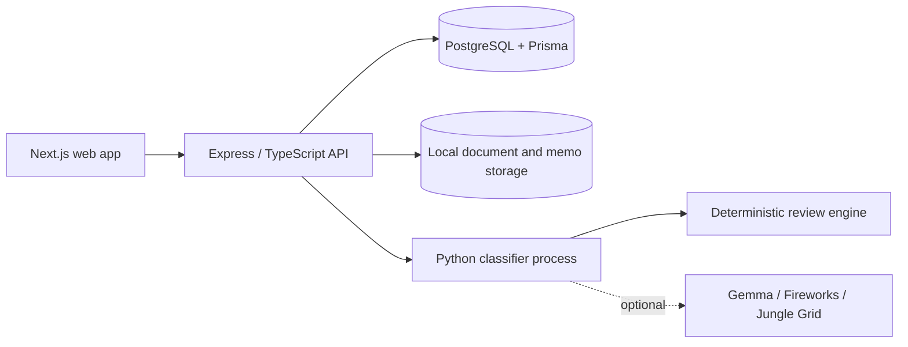

# Substrata

**Export classification infrastructure for advanced hardware.**

Substrata helps compliance teams turn technical product documents into traceable export-classification review packages containing extracted facts, recommended review paths, candidate ECCNs, uncertainty flags, company-history comparisons, reviewer questions, and a human-review-ready memo.

Substrata supports qualified human review. It does not provide legal advice or independently approve classifications.

## Problem

Export classification is often slow, fragmented, dependent on scarce expertise, and difficult to audit. Relevant evidence is spread across datasheets, internal decisions, counsel guidance, and regulatory material. Reviewers must reconstruct both the technical record and the reason for each decision.

## What Substrata does

Substrata implements this review flow:

```text
Technical document
  → document qualification
  → product/entity resolution
  → technical fact extraction
  → product-form and capability modelling
  → review-path evaluation
  → candidate assessment
  → company-history comparison
  → human-review memo
```

The current MVP includes technical-document upload, evidence-backed fact extraction, product-form resolution, open ECCN review paths, candidate blockers and missing evidence, reviewer questions, organization-scoped company-history comparison, audit events, memo generation, and conservative abstention when evidence is insufficient. Candidate ECCNs are hypotheses for review, not approved classifications.

## Demo workflow

The repository includes a fictional NX120 Secure SmartNIC product brief designed to open networking and information-security review paths.

1. Sign in with `owner@substrata.local` and the local demo password `SubstrataDemoPass123!`.
2. Upload [`workers/classifier/samples/nx120-secure-smartnic.txt`](workers/classifier/samples/nx120-secure-smartnic.txt).
3. Start a classification run in **Remote** mode. With no provider keys configured, the public demo uses deterministic heuristic fallback.
4. Review the resolved product model and extracted evidence.
5. Inspect the networking and cryptography review paths.
6. Treat 5A991 and 5A002, if surfaced, as unsupported hypotheses until their criteria and current regulatory sources are verified.
7. Review missing evidence and reviewer questions, then open the generated memo draft.

The fixture is synthetic and intentionally incomplete. Results are demonstration output, not legal advice.

## Architecture



The API launches the Python classifier as a child process for each run; there is not a separate long-lived worker service in the public Compose stack. PostgreSQL stores workspace, review, evidence, candidate, memo, and audit records. Uploaded files and generated artifacts use a Docker volume.

## Repository structure

| Path | Purpose |
| --- | --- |
| `apps/web` | Next.js compliance workspace |
| `apps/api` | Express API, authentication, authorization, orchestration, and audit workflows |
| `workers/classifier` | Python extraction, review routing, candidate assessment, and memo generation |
| `packages/db` | Prisma schema, migrations, client, and fictional demo seed |
| `packages/shared` | Shared TypeScript schemas and types |
| `infra` | Deployment Dockerfile, production Compose example, and runtime notes |
| `docs` | Product, architecture, compliance-boundary, and hackathon documentation |

## Prerequisites

- Git
- Docker Engine with the Docker Compose v2 plugin (`docker compose version`)
- Internet access on the first build to pull images and install locked dependencies

No host Node.js or Python installation is required for the Docker path. Resource use depends on Docker and build cache; no minimum memory or disk figure has been established by repository testing.

## Quick start with Docker

```bash
git clone https://github.com/Jungle-Grid/substrata.git
cd substrata
cp .env.example .env
docker compose config --quiet
docker compose up --build -d
docker compose ps
```

First startup builds the API/web images, waits for PostgreSQL, applies committed Prisma migrations, loads fictional demo data, and then starts the API and web app. Expected services and endpoints:

| Service | Address | Notes |
| --- | --- | --- |
| Web | <http://localhost:3000> | Sign-in and compliance workspace |
| API health | <http://localhost:4000/v1/health> | Includes a database connectivity check |
| PostgreSQL | `127.0.0.1:5433` | Exposed for local inspection only; containers use the private Compose network |
| `migrate` | one-shot service | Must exit successfully before seeding |
| `seed` | one-shot service | Loads fictional users and a completed example review |

Watch startup or inspect a failure with:

```bash
docker compose logs -f api web migrate seed
```

Stop the stack while retaining local database and uploaded-file volumes:

```bash
docker compose down
```

Restart it with `docker compose up -d`. To delete local demo data, run `docker compose down --volumes`; this is destructive to the local Compose volumes.

## Running the NX120 demo

Open <http://localhost:3000/sign-in>, use the demo owner credentials above, and upload the NX120 fixture from the Demo workflow section. The default seeded workspace is configured for Remote execution. Leave all optional provider keys blank to exercise the deterministic fallback path. A completed run should expose the canonical product model, extracted facts and citations, open review paths, candidate status, missing evidence, reviewer questions, audit activity, and memo draft.

The seed also creates a completed fictional Orion-X7 review that can be inspected without starting a new run.

## Environment variables

`.env.example` is the source of truth for the public local path. Docker Compose overrides `DATABASE_URL` inside containers so the host-friendly value can retain port `5433`.

| Variable | Service | Requirement | Purpose / safe default |
| --- | --- | --- | --- |
| `POSTGRES_DB`, `POSTGRES_USER`, `POSTGRES_PASSWORD` | PostgreSQL | Required | Local database settings; example values are development-only |
| `DATABASE_URL` | API/tools | Required | Host connection string; Compose injects its private-network equivalent |
| `APP_URL`, `WEB_APP_URL` | API | Required | Web origin, default `http://localhost:3000` |
| `API_URL`, `API_PORT` | API | Required | API address and port, default `http://localhost:4000` / `4000` |
| `NEXT_PUBLIC_API_BASE_URL` | Web | Required | Browser-visible API base, default `http://localhost:4000` |
| `API_CORS_ORIGIN` | API | Required | Allowed web origin, default `http://localhost:3000` |
| `LOCAL_STORAGE_ROOT` | API | Required | Local uploads/artifacts; Compose uses a named volume |
| `SESSION_SECRET` | API | Required for shared/production use | Example is local-only and must be replaced outside a private workstation |
| `EMAIL_PROVIDER` | API | Required | `console` for local demo; no mail is sent |
| `GOOGLE_CLIENT_ID`, `GOOGLE_CLIENT_SECRET` | API | Optional | Google OAuth; password login works without them |
| `AI_FALLBACK_TO_HEURISTIC` | Worker | Required for credential-free demo | Enables deterministic fallback for Remote runs |
| `SUBSTRATA_MIN_OWNED_PRODUCT_EVIDENCE` | Worker | Optional | Minimum owned-product evidence threshold, default `1` |
| `LOCAL_GEMMA_*`, `OLLAMA_HOST`, `GEMMA_MODEL` | Worker | Optional | Separately managed Ollama or Transformers/Gemma local assistance |
| `FIREWORKS_API_KEY`, `FIREWORKS_*` | Worker | Optional | Fireworks remote model assistance and accounting settings |
| `JUNGLE_GRID_API_KEY`, `JUNGLE_GRID_*` | Worker | Optional | Jungle Grid prototype execution and provenance |
| `ZEPTOMAIL_SEND_MAIL_TOKEN`, `EMAIL_FROM_ADDRESS` | API | Optional locally; required with ZeptoMail | Transactional email production path |
| `SESSION_COOKIE_DOMAIN` | API | Production-only when origins differ | Shared cookie domain |
| `PUBLIC_DEMO_ADMIN_EMAILS` | API | Optional | Accounts allowed to manage public demo publication |

Additional timeout, retry, model, and provider-priority settings are documented inline in [`.env.example`](.env.example). `TEST_DATABASE_URL` and `CLASSIFICATION_HISTORY_DIAGNOSTICS` are test/diagnostic settings and are not needed by the Docker demo.

## Local development without Docker

Host-based application development is documented in [`infra/local-dev.md`](infra/local-dev.md). That path requires Node.js, Corepack/pnpm, Python, and a PostgreSQL instance. It is separate from the Docker-only quick start and was not revalidated as part of the Docker workflow.

## Testing

With locked dependencies installed, the repository CI commands are:

```bash
python3 -m unittest discover -s workers/classifier/tests -v
COREPACK_HOME=/tmp/corepack corepack pnpm lint
COREPACK_HOME=/tmp/corepack corepack pnpm typecheck
WEB_APP_URL=http://localhost:3000 COREPACK_HOME=/tmp/corepack corepack pnpm test
COREPACK_HOME=/tmp/corepack corepack pnpm build
node scripts/validate-worker-output.mjs workers/classifier/samples/output-sample.json --min-specs=8
```

API integration tests additionally require an isolated PostgreSQL database configured through `TEST_DATABASE_URL`; the script is `COREPACK_HOME=/tmp/corepack corepack pnpm --filter @substrata/api test:integration`.

## Security and data handling

Uploaded technical documents may contain sensitive or export-controlled information. Do not upload controlled, proprietary, or confidential material to an unsecured demo. The NX120 fixture and seed identities are fictional; other worker samples contain compact public-product examples or synthetic test data. Local uploads, generated artifacts, environment files, logs, private keys, and common credential files are ignored by Git and excluded from Docker build contexts.

Store secrets in environment variables, never in source or images. `.env` is ignored. The API applies organization/workspace scoping to application records, but the public local configuration uses development credentials and loopback-bound ports. Any internet-facing or production deployment requires an independent security, access-control, storage, retention, network, email, and secrets-management review. See [`docs/SECURITY.md`](docs/SECURITY.md).

## Compliance boundary

> Substrata is a decision-support and document-analysis tool. It does not provide legal advice, determine legal obligations independently, or replace review by qualified export-control professionals.

## Known limitations

- Human review is mandatory.
- Local deterministic runs do not bundle an authoritative, current copy of export-control regulations; regulatory references can require independent verification.
- Some candidate ECCNs remain unsupported hypotheses when criteria or evidence are missing.
- Structured company-history presentation is still being refined; current matching is organization-scoped and lexical.
- Large or multi-product documents may require segmentation before review.
- Model-assisted provider paths require separately supplied credentials or runtime infrastructure.
- The public Docker path uses deterministic heuristic fallback when no Remote provider is configured.
- Local Gemma mode does not silently fall back; it requires its configured model runtime.

## AMD hackathon usage

The repository contains a hackathon prototype for model-assisted extraction on AMD-backed infrastructure:

- [`infra/jungle-grid-image/Dockerfile`](infra/jungle-grid-image/Dockerfile) packages the classifier entrypoint for a Jungle Grid worker image.
- The image metadata and runtime contract identify ROCm and AMD GPU execution, while the Python backend records provider/model provenance returned by Jungle Grid.
- [`docs/JUNGLE_GRID_INTEGRATION.md`](docs/JUNGLE_GRID_INTEGRATION.md) describes the managed-execution direction and its current boundaries.

The public Docker quick start is CPU-compatible and does **not** require AMD hardware, ROCm, Jungle Grid, or cloud credentials. The AMD/Jungle Grid path is an optional hackathon execution path, not a claim that every local run uses AMD compute or that a production AMD deployment exists.

## Technology stack

- Next.js 15, React 19, and TypeScript
- Express 5 API
- PostgreSQL 16 and Prisma 6
- Python 3 classifier worker
- Docker and Docker Compose
- Optional Ollama or Transformers/Gemma, Fireworks, and Jungle Grid provider backends

## Project status

Substrata is an MVP/prototype under active development. Interfaces, review logic, and operational controls may change.

## Contributing

Keep source evidence, uncertainty, human-review boundaries, and organization scoping visible in every change. Do not commit provider credentials, private documents, generated memos, or local environment files.

## License

Substrata is available under the [MIT License](LICENSE).
