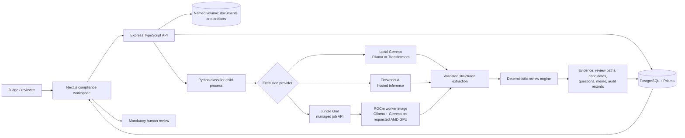

# Substrata — AMD AI Hackathon

**AI-assisted export-classification infrastructure for semiconductors and advanced hardware, built for the AMD AI Hackathon.**

Substrata turns a technical product document into extracted specifications, cited review paths, candidate ECCN hypotheses, uncertainty flags, reviewer questions, organization-scoped history comparisons, audit records, and a human-review-ready classification memo draft. Gemma supports model-assisted technical extraction and reasoning; Fireworks AI provides a hosted inference path; Jungle Grid provides the managed job-execution layer; and the repository includes a Gemma container path designed for AMD GPUs through ROCm.

Unlike a generic chatbot, model output is input to Substrata’s deterministic review engine. Product/entity resolution, capability modelling, review-path routing, candidate gating, citations, missing-evidence checks, conservative abstention, and mandatory human review remain explicit application logic.

## Built for the AMD AI Hackathon

The hackathon implementation connects five concrete layers:

| Technology                  | Role in Substrata                                                                                                                                                          | Repository evidence                                                                                                             |
| --------------------------- | -------------------------------------------------------------------------------------------------------------------------------------------------------------------------- | ------------------------------------------------------------------------------------------------------------------------------- |
| **Gemma**                   | Produces structured, model-assisted technical extraction through either a local Ollama/Transformers runtime or the Jungle Grid worker image.                               | [`local_backend.py`](workers/classifier/src/backends/local_backend.py), [Jungle Grid image](infra/jungle-grid-image/Dockerfile) |
| **Fireworks AI**            | Provides hosted model inference for Remote mode. The configured default is `accounts/fireworks/models/gpt-oss-120b`; Fireworks is not misrepresented as the Gemma runtime. | [`fireworks_backend.py`](workers/classifier/src/backends/fireworks_backend.py)                                                  |
| **Jungle Grid**             | Estimates, submits, reconciles, and polls managed inference jobs; captures output, cost, token, image, provider, GPU, and runtime provenance when returned.                | [`jungle_grid_backend.py`](workers/classifier/src/backends/jungle_grid_backend.py)                                              |
| **AMD / ROCm**              | The Jungle Grid job requests an AMD GPU and runs an `ollama/ollama:rocm` image with `gemma4:12b` baked into it.                                                            | [`infra/jungle-grid-image`](infra/jungle-grid-image)                                                                            |
| **Substrata review engine** | Converts extracted facts into deterministic product models, cited review paths, candidate status, missing evidence, reviewer questions, abstentions, and memo artifacts.   | [classifier source](workers/classifier/src)                                                                                     |

The AMD/Jungle Grid path is implemented as a prototype contract and container image. Contract tests verify the submitted GPU/ROCm payload and normalized result handling. A successful live AMD allocation is not proven by this repository alone and requires a working Jungle Grid account, credential, published image, and available AMD/ROCm capacity.

### What a judge can run now

- **Credential-free:** start the CPU-compatible Docker stack and inspect the seeded completed Orion-X7 review.
- **Recommended NX120 run:** configure Fireworks, upload the fictional NX120 SmartNIC brief, and start a Remote run.
- **Local Gemma:** connect an existing Ollama or compatible Transformers/Gemma runtime and start a Local run.
- **AMD/ROCm prototype:** enable Jungle Grid with a valid key and published ROCm image, then start a Remote run.

A new NX120 classification run requires at least one configured execution provider. Deterministic fallback is available after a selected Remote backend fails; it is not a substitute for provider selection when every provider is disabled.

## Judge demo: NX120 Secure SmartNIC

The main demo fixture is [`workers/classifier/samples/nx120-secure-smartnic.txt`](workers/classifier/samples/nx120-secure-smartnic.txt). It is fictional and intentionally incomplete so reviewers can see networking and cryptography review paths, missing evidence, uncertainty, and conservative candidate handling.

### Hosted hackathon demo

Open [substrata.junglegrid.dev](https://substrata.junglegrid.dev) and use the public, demo-only account:

- **Work email:** `demo@junglegrid.dev`
- **Password:** `IamAWinner.AMD`

These credentials are intended only for the public hackathon demo. Do not reuse them for another environment or account.

### Recommended Fireworks path

Add these values to the local `.env` after copying [`.env.example`](.env.example):

```dotenv
FIREWORKS_ENABLED=true
FIREWORKS_API_KEY=<your-fireworks-api-key>
FIREWORKS_MODEL=accounts/fireworks/models/gpt-oss-120b
AI_FALLBACK_TO_HEURISTIC=true
```

Then:

1. Open <http://localhost:3000/sign-in>.
2. Sign in as `owner@substrata.local` with `SubstrataDemoPass123!`.
3. Upload the NX120 fixture.
4. Start a **Remote** classification run.
5. Inspect the canonical product model and source-grounded specifications.
6. Compare the networking and information-security review paths.
7. Review 5A991 and 5A002 only as hypotheses; unsupported candidates remain blocked from approval.
8. Review missing evidence, reviewer questions, execution provenance, audit activity, and the memo draft.

Expected output is a review package, not an approved classification.

## Runtime flow

```text
Document upload
  → document qualification and product/entity resolution
  → execution-provider selection
  → model-assisted structured extraction
  → deterministic fact normalization and capability modelling
  → review-path evaluation and candidate gating
  → company-history comparison
  → citations, blockers, missing evidence, and reviewer questions
  → memo and audit artifacts
  → qualified human review
```

Model extraction is deliberately separated from classification control logic. Provider JSON is parsed and schema-validated before extracted facts are merged. The deterministic engine then applies review profiles, evidence polarity, contradictions, regulatory-source requirements, and abstention rules.

## Architecture



The public Compose stack does not run a separate long-lived worker service. The API launches the Python classifier as a child process for each run, and the worker calls the selected local or remote backend.

## Execution paths

### CPU-compatible deterministic fallback

Set `AI_FALLBACK_TO_HEURISTIC=true`. If a selected Remote backend fails, the worker can continue with deterministic extraction and review logic. With all providers disabled, judges can still inspect the completed seeded review, but starting a new Remote run fails clearly because there is no selected provider.

### Fireworks-hosted inference

```dotenv
FIREWORKS_ENABLED=true
FIREWORKS_API_KEY=<secret>
FIREWORKS_MODEL=accounts/fireworks/models/gpt-oss-120b
```

The worker sends the bounded document prompt to the Fireworks inference API, parses the returned structured JSON, records latency/token/cost metadata when available, and passes the extraction into the deterministic engine.

### Local Gemma

```dotenv
LOCAL_GEMMA_ENABLED=true
LOCAL_GEMMA_RUNTIME=ollama
LOCAL_GEMMA_MODEL=gemma4:e2b
LOCAL_GEMMA_BASE_URL=http://host.docker.internal:11434
```

The local backend supports `ollama` and `transformers`. The Transformers path expects a separately prepared PyTorch/Transformers environment with a visible configured GPU; those large model dependencies are not installed by the public application image.

### Jungle Grid on the AMD/ROCm path

```dotenv
JUNGLE_GRID_ENABLED=true
JUNGLE_GRID_API_KEY=<secret>
JUNGLE_GRID_API_URL=https://api.junglegrid.dev
JUNGLE_GRID_IMAGE=ghcr.io/jungle-grid/substrata-jungle-grid-inference:rocm
JUNGLE_GRID_MODEL=gemma4:12b
JUNGLE_GRID_RUNTIME_BACKEND=rocm
JUNGLE_GRID_GPU_VENDOR=AMD
AI_FALLBACK_TO_HEURISTIC=false
```

The worker submits `/app/run-extraction.sh` as a managed Jungle Grid job, requests one AMD GPU, passes the prompt/model through the job environment, polls status, reconciles ambiguous submissions by request ID, and captures returned hardware/runtime/image provenance. `AI_FALLBACK_TO_HEURISTIC=false` is recommended when proving that a demo result actually used the AMD path.

## Docker quick start

### Prerequisites

- Git
- Docker Engine
- Docker Compose v2
- Internet access for the first image build

No host Node.js or Python installation is required.

```bash
git clone https://github.com/Jungle-Grid/substrata.git
cd substrata
cp .env.example .env
docker compose config --quiet
docker compose build migrate api web
docker compose up -d postgres
docker compose run --rm migrate
docker compose --profile manual run --rm seed
docker compose up -d api web
docker compose ps
```

| Service    | Address                           | Purpose                                                 |
| ---------- | --------------------------------- | ------------------------------------------------------- |
| Web        | <http://localhost:3000>           | Judge-facing compliance workspace                       |
| API        | <http://localhost:4000/v1/health> | API and database health                                 |
| PostgreSQL | `127.0.0.1:5433`                  | Loopback-only local database port                       |
| `migrate`  | One-shot                          | Applies committed Prisma migrations                     |
| `seed`     | Manual profile                    | Loads fictional demo accounts and completed review data |

```bash
docker compose logs -f api web migrate
docker compose down
docker compose up -d
```

`docker compose down` retains named volumes. `docker compose down --volumes` deletes local database and artifact data and must never be used in production.

The Compose configuration and service/profile topology have been validated locally with the checked-in example environment. A clean image build was not rerun in the current no-download environment; the Dockerfile and build commands remain part of CI/VPS verification.

## Environment configuration

[`.env.example`](.env.example) is the safe local template.

| Variable                                                | Required       | Purpose                                                         |
| ------------------------------------------------------- | -------------- | --------------------------------------------------------------- |
| `POSTGRES_DB`, `POSTGRES_USER`, `POSTGRES_PASSWORD`     | Yes            | PostgreSQL and internal Prisma URL                              |
| `SESSION_SECRET`                                        | Yes            | Session/token hashing; local template value is development-only |
| `NEXT_PUBLIC_API_BASE_URL`                              | Yes            | Public API URL embedded into the web build                      |
| `AI_FALLBACK_TO_HEURISTIC`                              | Recommended    | Deterministic fallback after a selected Remote backend fails    |
| `FIREWORKS_ENABLED`, `FIREWORKS_API_KEY`                | Fireworks path | Hosted inference                                                |
| `LOCAL_GEMMA_ENABLED`, `LOCAL_GEMMA_*`                  | Local path     | Local Ollama/Transformers Gemma                                 |
| `JUNGLE_GRID_ENABLED`, `JUNGLE_GRID_API_KEY`            | AMD path       | Managed Jungle Grid execution                                   |
| `JUNGLE_GRID_IMAGE`, `JUNGLE_GRID_MODEL`                | AMD path       | ROCm image and baked Gemma model                                |
| `JUNGLE_GRID_RUNTIME_BACKEND`, `JUNGLE_GRID_GPU_VENDOR` | AMD path       | Requests/records ROCm and AMD placement                         |

Provider keys are runtime-only API/worker secrets and are not sent to the browser or baked into the web image. Only `NEXT_PUBLIC_API_BASE_URL` is a frontend build argument.

Production configuration, the complete variable inventory, validation, and VPS flow are in [`infra/production-deployment.md`](infra/production-deployment.md).

## Repository structure

| Path                      | Purpose                                                             |
| ------------------------- | ------------------------------------------------------------------- |
| `apps/web`                | Next.js compliance workspace                                        |
| `apps/api`                | Authentication, tenancy, orchestration, persistence, and audit API  |
| `workers/classifier`      | Provider backends, deterministic review engine, and memo generation |
| `packages/db`             | Prisma schema, migrations, and fictional demo seed                  |
| `packages/shared`         | Shared schemas and API/worker contracts                             |
| `infra/jungle-grid-image` | ROCm-oriented Ollama/Gemma job image                                |
| `compose.yml`             | Local and production-capable service topology                       |
| `docs`                    | Product, architecture, security, and execution documentation        |

## Validation

```bash
python3 -m unittest discover -s workers/classifier/tests -v
COREPACK_HOME=/tmp/corepack corepack pnpm test:production-env
COREPACK_HOME=/tmp/corepack corepack pnpm lint
COREPACK_HOME=/tmp/corepack corepack pnpm typecheck
WEB_APP_URL=http://localhost:3000 COREPACK_HOME=/tmp/corepack corepack pnpm test
COREPACK_HOME=/tmp/corepack corepack pnpm build
node scripts/validate-worker-output.mjs workers/classifier/samples/output-sample.json --min-specs=8
```

The tests cover deterministic routing and evidence invariants, provider selection, local Gemma behavior, Fireworks behavior, the Jungle Grid payload/result contract, API security, and production environment validation. Live provider tests require explicit credentials and are not part of the credential-free suite.

## Security and data handling

Uploaded hardware documents may contain proprietary, export-controlled, or otherwise sensitive information. Do not upload controlled or confidential documents to an unsecured demo or send them to a remote provider without authorization.

The NX120 fixture, seed users, and seeded company are fictional. Environment files, local uploads, generated artifacts, logs, private keys, and credential files are ignored by Git and excluded recursively from Docker build contexts. Provider keys belong only in untracked environment files or a production secrets manager.

See [`docs/SECURITY.md`](docs/SECURITY.md).

## Compliance boundary

> Substrata is a decision-support and document-analysis tool. It does not provide legal advice, determine legal obligations independently, independently approve classifications, or replace review by qualified export-control professionals.

Candidate ECCNs are review hypotheses. Human review is mandatory.

## Known limitations

- The repository proves the Jungle Grid API contract and ROCm image path, not a successful live AMD allocation.
- The default Docker stack is CPU-compatible and does not require or automatically use AMD hardware.
- New classification runs require a configured execution provider; deterministic fallback occurs only after provider selection.
- Local Transformers/Gemma requires separately managed model and GPU dependencies.
- Official, current regulatory text is not bundled into deterministic local runs.
- Unsupported candidate ECCNs remain blocked hypotheses until evidence and regulatory-source requirements are satisfied.
- Large or multi-product documents may require segmentation.
- Company-history retrieval is organization-scoped and currently lexical.
- Human review is mandatory.

## Technology stack

- AMD/ROCm-oriented inference container
- Gemma through Ollama or Transformers
- Fireworks AI hosted inference
- Jungle Grid managed execution API
- Python deterministic classifier
- Next.js 15, React 19, TypeScript, and Express 5
- PostgreSQL 16 and Prisma 6
- Docker and Docker Compose

## Project status

Substrata is an AMD AI Hackathon MVP/prototype under active development.

## License

Substrata is available under the [MIT License](LICENSE).
